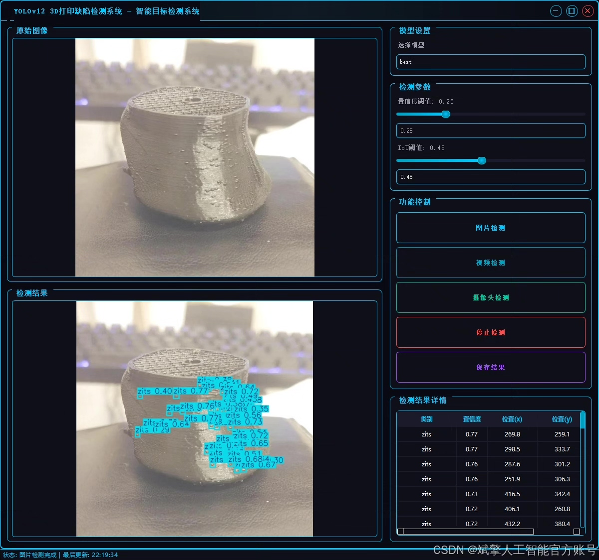
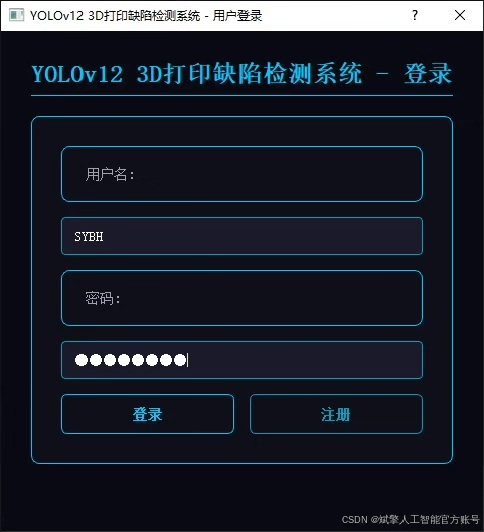
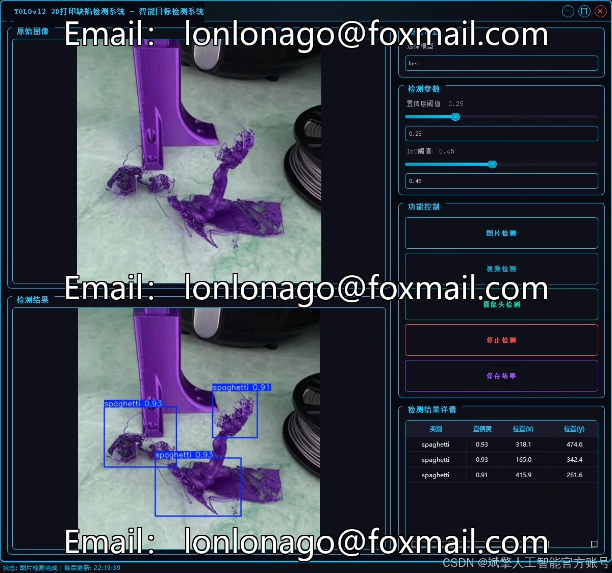
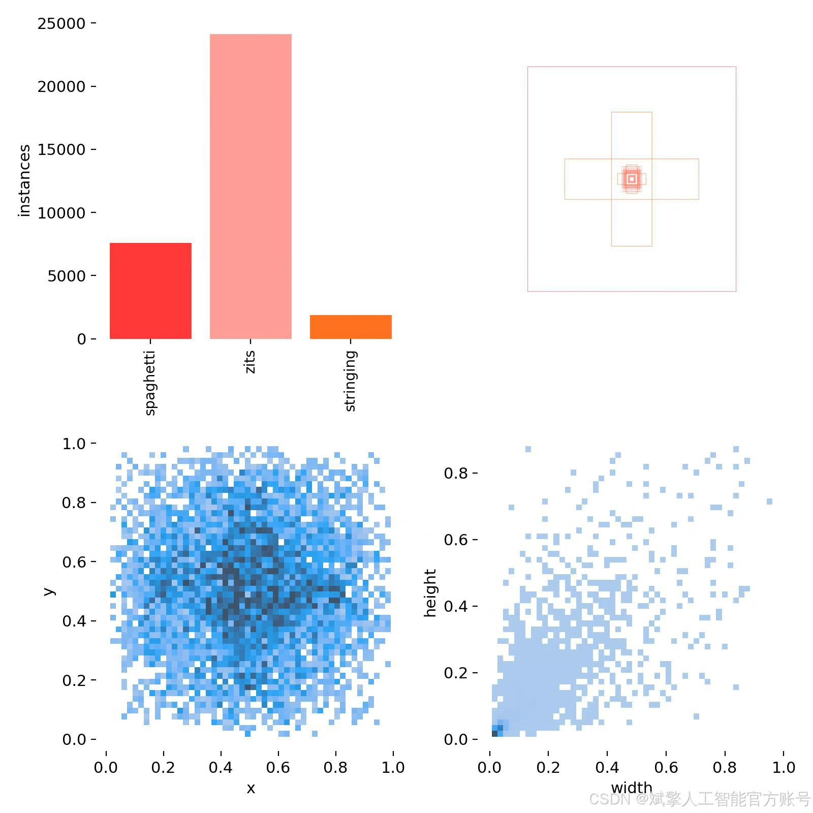
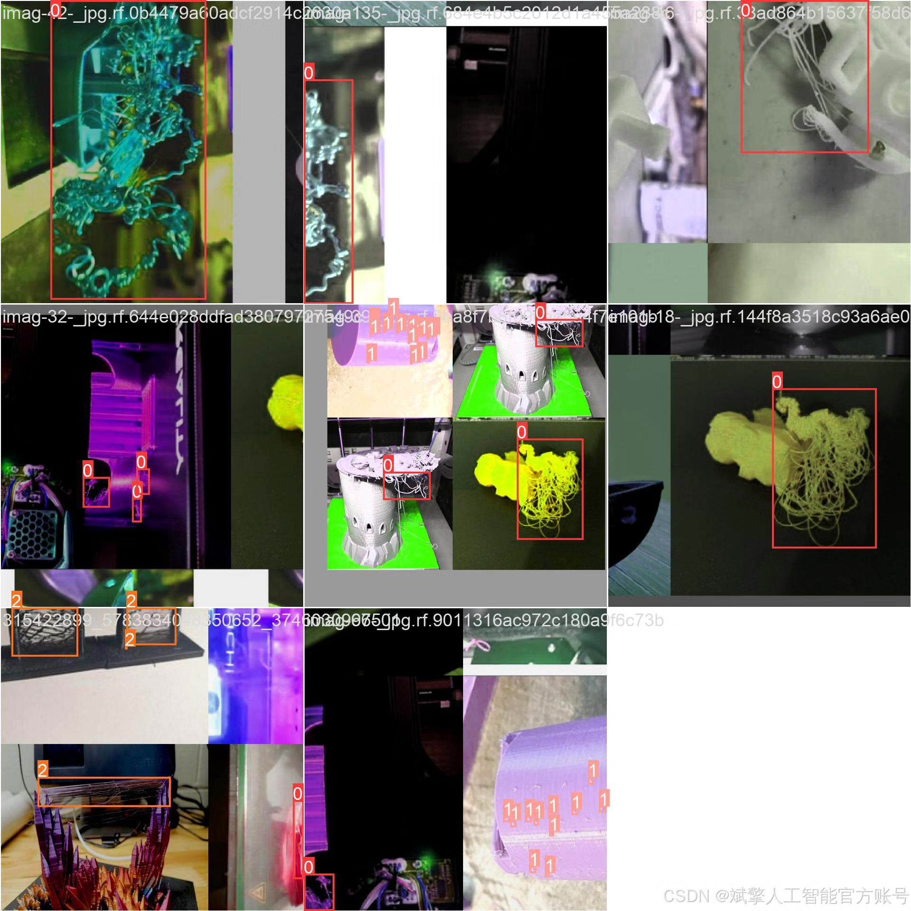
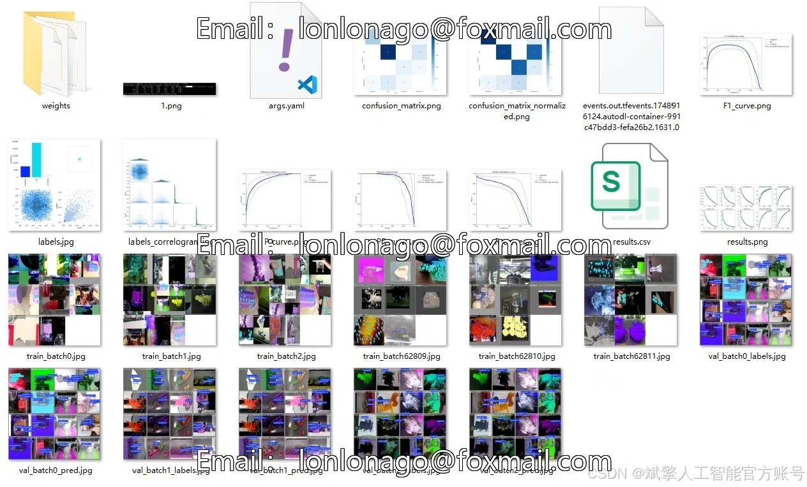
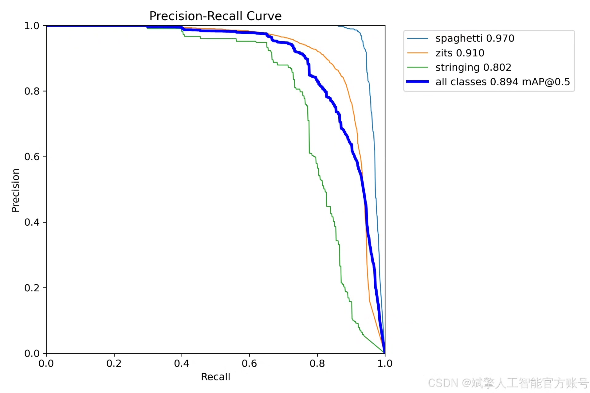
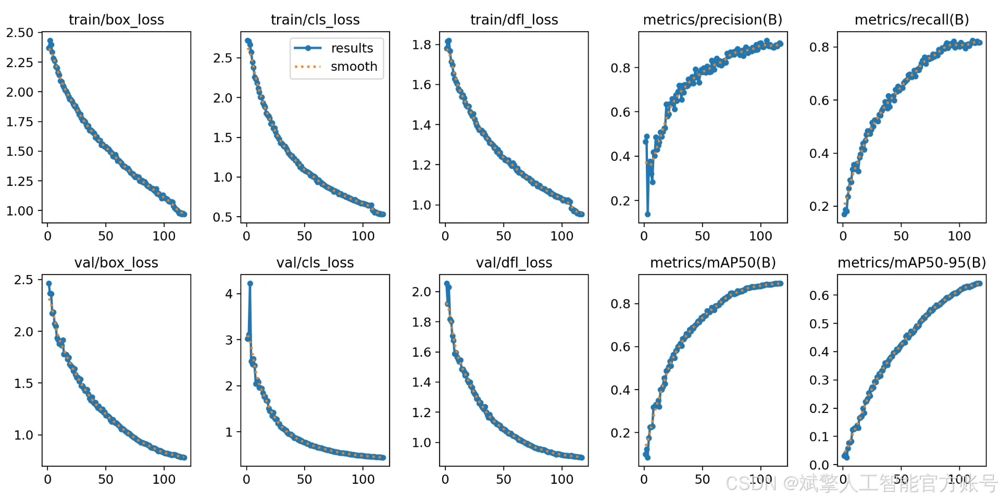
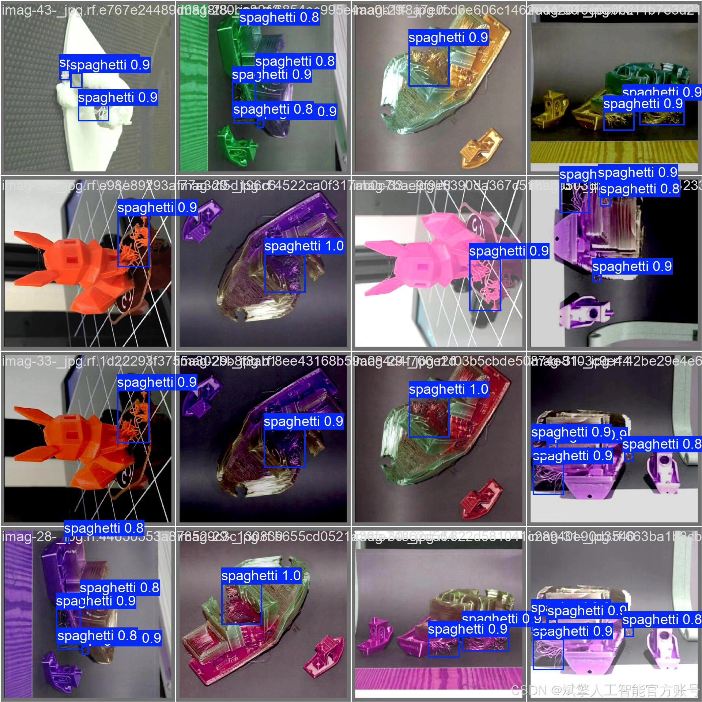

# YOLOv12 3D Printing Defect Identification System

## Body

YOLOv12 3D Printing Defect Identification System Based on Deep Learning YOLOv12

This project is based on the YOLOv12 deep learning framework to develop an efficient and precise 3D printing defect identification system. It can automatically identify and classify common 3D printing defects, including Spaghetti (ribbon), Zits (spots), and Stringing (string-like residues). The system uses the PyTorch framework for model training and optimization, combined with the YOLO format dataset, achieving high accuracy in target detection. Additionally, the system features a user-friendly UI interface that supports login and registration functions, facilitating user management and use. The project provides complete Python project source code, pre-trained models, and detailed datasets, which can be widely applied in areas such as 3D printing quality monitoring and intelligent manufacturing, helping users quickly locate and optimize printing issues, and improve production efficiency.

Dataset:
nc: 3 classes,
Name: ['spaghetti', 'zits', 'stringing'],
Dataset quantity: 4696 training sets, 587 validation sets, 587 testing sets.

✅ User Login and Registration: Supports password verification and security validation.
✅ Three detection modes: Based on the YOLOv12 model, supports image, video, and real-time camera detection, accurately identifying targets.
✅ Dual-screen comparison: Displays original images and detection results on the same screen.
✅ Data visualization: Real-time table display of detected target categories, confidence levels, and coordinates.
✅ Intelligent parameter adjustment: Offers a confidence slide bar for dynamically optimizing detection accuracy, adapting to different scene requirements.
✅ Sci-fi style interactive interface: Dark theme paired with dynamic light effects, reducing visual fatigue and enhancing operational experience.

## Images

## Payment

Here is a pay link on Stripe ( https://buy.stripe.com/3cs8yP7sY87d0vu9AB ). Please contact me lonlonago@foxmail.com after funding $89, and I will send you a complete data files , thank you!

